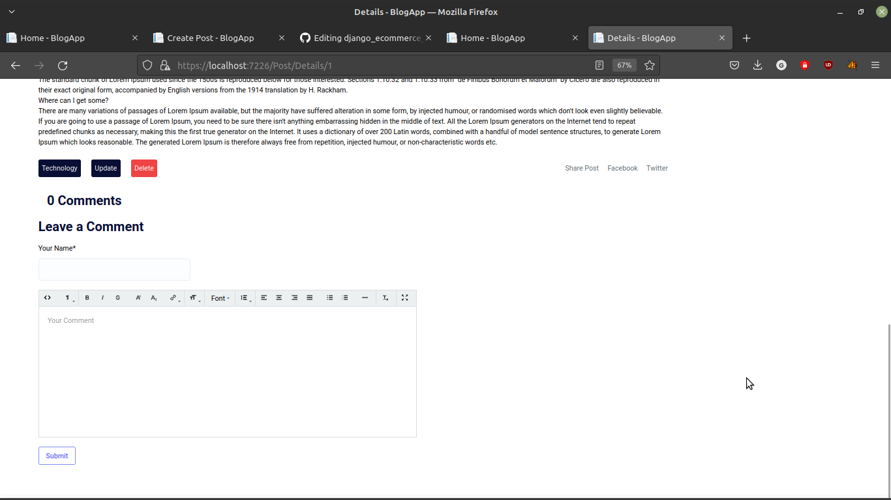

# BlogApp

Blogapp is web application for creating blog posts and commenting on blog post.

## Development Environment

- Linux Mint 20 
- VS Code

## Features

- Post Blog With upload image
- Comment on blog post(JQuery Ajax Request)
- Create Blog Category
- View Posts and filter them by category
- Delete & Update Posts and Category

## Libraries, Development Stack and Database Used

- asp.net core 6 MVC
- JQuery for ajax request
- Tailwindcss for styling
- Trumbowyg for Rich Text Editor
- PostgresQl

## Docs Images

### Home View

### Post Details View

### Post Create View

### Comment Form View

### Categories Home View

